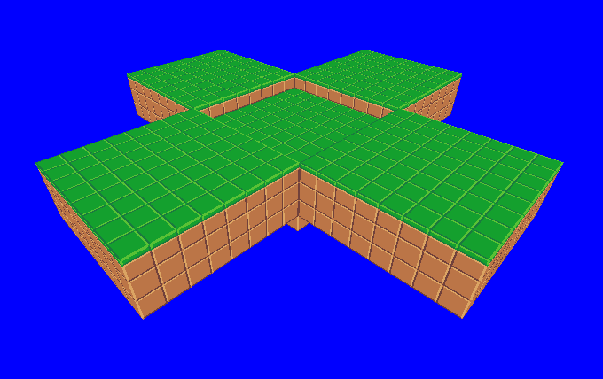

# Crafty

(The beginning of) A MineCraft clone coded with OpenGL, fully in Rust !

Note that the entire **game engine** is written by ourselves, using **only a driver to OpenGL** !

### Current list of features

- Rendering textured cubes of different kinds with OpenGL
  - OpenGL instancing allows to render thousands of cubes very fast.
- World is divided in chunks of equal sizes
- First Player Camera
- Detection of collision
- Gravity, Free-Fall, Jumping
- Easy way to import textures into the game
- Easy way to presents `Tiles` on the screen (menus)

### Missing features (short term milestones)

- Better implementation of the collision detection 
    - Why not refactoring to use the same code that is used to detect the 'selected' cube ? 

- Tiles library: 
    - Display text (no linebreaks)
    - Display menu

- OpenGl improvements: remove cubes that are not visible to improve the FPS with a lot of cubes
      - cubes behind the player
      - cubes that are not touching the air

- OpenGL improvements: full-screen mode

- Client must be able to edit the map
    - Show the currently selected block (done)
    - Deletion of cubes (done)
    - Addition of cubes

- Multiplayer architecture design & Multiplayer implementation through server / client
    - The server holds the full map and sends the chunk to the players as they move
    - Action model to edit the map
    - Drawing players differently

- Automatic & Infinite map creation

- Entities: display other players

- Entities: add monsters
