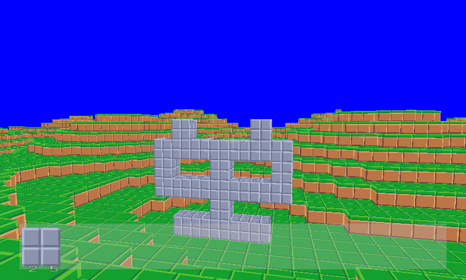
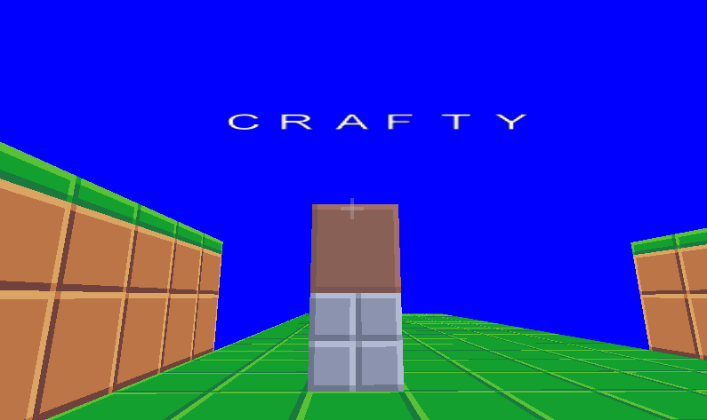

# Crafty

A multiplayer MineCraft clone coded with OpenGL, fully in Rust !

Note that the entire **game engine** (3D rendering and physics) is written by ourselves, using **only a driver to OpenGL**. Similarly, the full **server-client communication and synchronization** is done from scratch, using nothing more than Rust's internal functionalities.






## Current list of features

- Rendering textured cubes of different kinds with OpenGL
  - OpenGL instancing allows to render thousands of cubes very fast.
- First Player Camera
- Detection of collision
- Gravity, Free-Fall, Jumping
- Edition of the world like in minecraft
- Easy way to import textures into the game
- Easy way to presents `Tiles` on the screen (menus, texts)
- Persistent world: loading and Saving the world to the disk
- Randomized map creation
- Multiplayer mode: a server that synchronizes different players

## Getting started

This is still a work-in-progress, but the `main` branch is supposed to run.

To run in **single player**, use

```console
cargo run --bin crafty
```

To run in **multi player**, use 

```console
cargo run --bin server
cargo run --bin client
```

Under the hood, there is always a server that is started and contains the world's internal model.

## Missing features (short term milestones)

- Better implementation of the collision detection 
- Automatic & Infinite map creation [Johan]
- Improvements of the multiplayer architecture (this might not be necessary...)
- Entities: display other players (as they move)
- Entities: monsters display
- Entities: monsters logic
- Crafting menu & logic
- Stabilization of all the bugs that we find...
